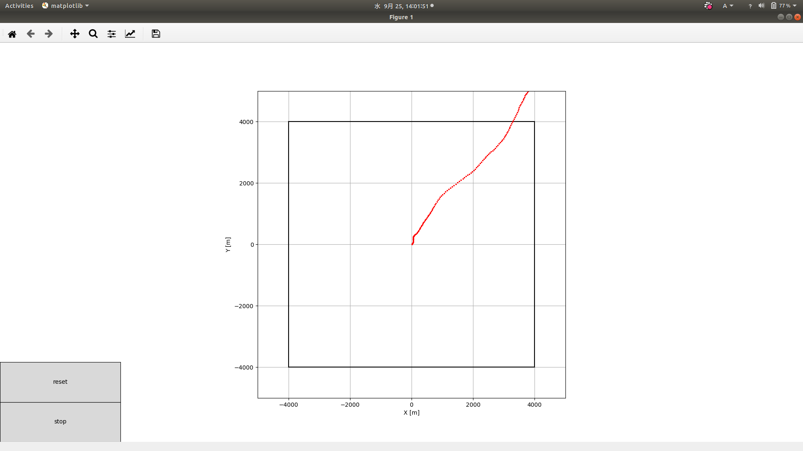
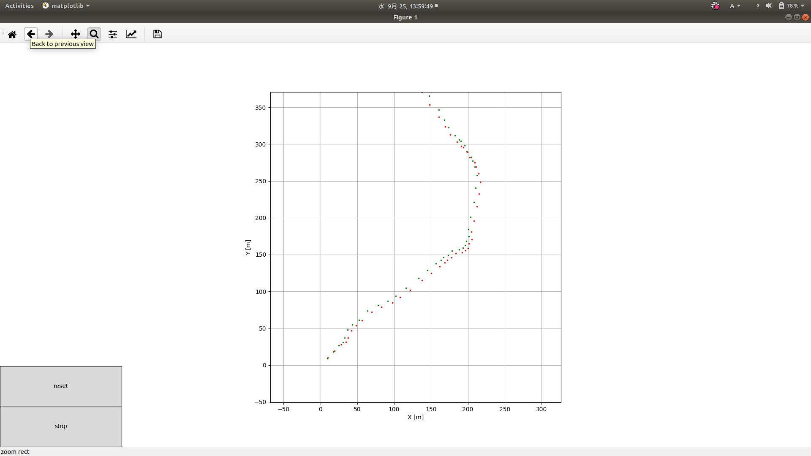
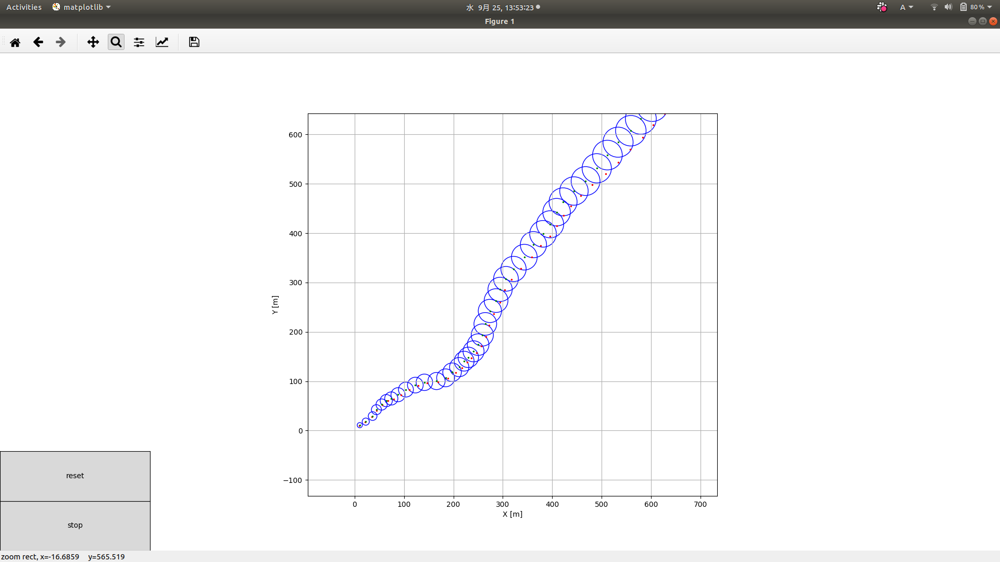
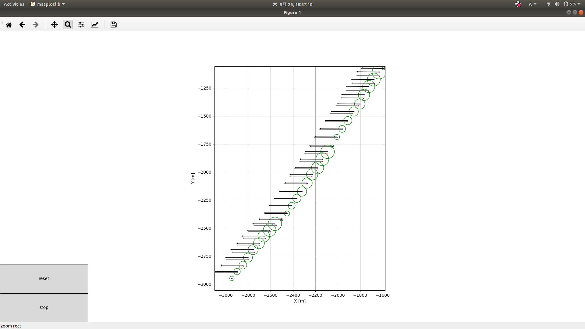
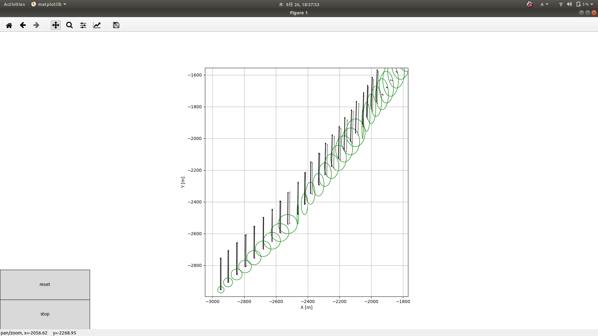
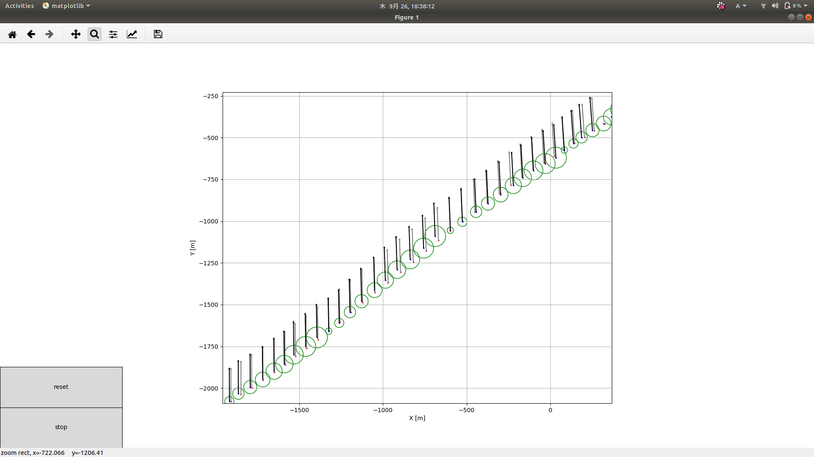

# 自己位置推定講習
* 基本的な自己位置推定をしてみたり
* ベイズの定理を用いた自己位置推定をしてみたりしましょう
## 環境構築
* このプロジェクトはpython3を使います
* 基本はC++を使ってきたはずですが、pythonも使えて損はない(どうせ使う)のでこれを機になれましょう(難しいことはしない)
* python3の環境構築は人それぞれで好きにやってください(jupyter-notebookやanacondaやpyenvなどなど)
* 一番やってはいけないのはanacondaでやってたのに以下の方法もやるとかです(コンフリクトします)
* ある程度理解しているなら好きなようにやって良いですが、とりあえず以下の方法でをおすすめします
* python3のインストール
```
$ sudo apt update
$ sudo apt install python3 python3-pip python-pip
$ sudo pip install numpy matplotlib
```
* 以下のコマンドでdefault.pyが動きしたの写真のようになればよい(赤の点のプロットの仕方は異なります)
```
$ python3 default.py
```

* 左上のツールを使うと拡大できたりするのでもっと見やすくなると思います

## シミュレーター
* 詳しくはシミュレーターの関数一覧などを読めば良いがどのようなシミュレーターかについて
* シミュレーターはx,y,thetaの３変数のとそれの一回微分と二回微分の状態量をもちます
* update関数が呼ばれると一定の分散をもちながらそれぞれ積分して時間更新されます
* 制御周期は10msとしています
* エンコーダーはマシン座標系でx方向とy方向に非常に精度高く並行についているとします
* エンコーダーの返す値は差分であり、速度ではありません
* gyroセンサーもマシンに剛に固定されており精度高くマシンの角速度を返してくれるとします
## よくある決定論的自己位置推定
* とりあえず環境構築でシミュレーターを動かすことはできたでしょうか
* じゃあさっそく簡単な自己位置推定をしてみましょう
* シミュレーターの関数に実装されているget\_enc関数とget\_gyro関数を用いて自己位置推定をしてみましょう

```
theta += get_gyro() * dt
X += (回転行列[-theta]) * get_enc()
```
* 簡単なモデルなら上の式みたいな感じでしょうか
* 実装してみましょう
```python3:main.py
#! /usr/bin/python3

from sim import simulator
from drawer import drawer
import numpy as np
from config import config

def plot(data):
    global theta, X
    sim.update()
    #自己位置推定の更新
    theta += sim.get_gyro() * 10
    X += np.array([[np.cos(-theta),-np.sin(-theta)],[np.sin(-theta), np.cos(-theta)]]) @ sim.get_enc() #@は内積を意味する(回転行列をかけているだけ)
    ball_img = drawer.draw_point(sim.x,sim.y)
    ball_img = drawer.draw_point(X[0][0], X[1][0], "g")
    return ball_img

sim = simulator.Sim(0.,0.,1.,1.,0.,0.) #シミュレーターのコンストラクタ

#自己位置の初期値
theta = 0.
X = np.array([[0.,0.]]).T

drawer = drawer.Drawing(plot)

ball_img = config.init(drawer)

drawer.show()
```

* どうでしょうかそれっぽく自己位置推定できたのではないでしょうか？
* でも当然ですがだんだんずれていってしまいますね
* モデルをもっと正確にしたりと、もう少し改善の方法はありますがこれがエンコーダーとジャイロセンサーでの自己位置推定の限界でしょう
* こっからよくするならば、測距センサーやラインセンサーなどを用いるしかありません
* 測距センサーはシミュレーターに実装されているのでそれを使ってみるのも良いと思います
* しかし、測距センサーをうまく自己位置補正につかえるでしょうか？
* でっち上げで読んでいる柵を予測して適当に自己位置を書き換えることで補正できるでしょう(大体の大学はこういうことしてるんじゃないかなあ)
* でもマシンが予測しない位置にいたり、帰ってきた値がノイズでおかしくなってたりたりしたときの対応が面倒くさいですね

## 確率論的自己位置推定
* まずここからは決定論的に自己位置を決めるのではなくて、確率論的に自己位置を推定します
* どういうことかというと、自己位置の状態量(例えばx,y,theta)とその値の分散を自己位置の情報として常に持ち、それらを時間ごとに更新していくというものです
* つまり、マシンの自己位置はだいたいこの値を中心としてこの分散の中のどこかにはいるだろうといった感じで自己位置推定を行います
* 試しに上で行った自己位置推定を確率論的にしたものが下のコードです
```python3:main.py
#! /usr/bin/python3

from sim import simulator
from drawer import drawer
import numpy as np
from config import config

def plot(data):
    global x, y, theta,Ptheta,Px,Py #pythonのグローバル変数を使うときはこうやって宣言してあげなければいけない
    sim.update()
    theta += sim.get_gyro() * 10
    x += (np.array([[np.cos(-theta),-np.sin(-theta)],[np.sin(-theta), np.cos(-theta)]]) @ sim.get_enc())[0][0]
    y += (np.array([[np.cos(-theta),-np.sin(-theta)],[np.sin(-theta), np.cos(-theta)]]) @ sim.get_enc())[1][0]
    #分散も更新する
    #更新の量はセンサーの精度などから適当に決める
    Ptheta  += 0.0001
    Px += 100.
    Py += 100.
    ball_img = drawer.draw_point(sim.x,sim.y)
    ball_img = drawer.draw_point(x,y,"g")
    ball_img = drawer.draw_circle(x,y,np.sqrt(Px),np.sqrt(Py)) #分散は二乗なので同じ次元に落として表示する
    return ball_img

sim = simulator.Sim(0.,0.,1.,1.,0.,0.) #シミュレーターのコンストラクタ

#自己位置
x = 0.
y = 0.
theta = 0.
#自己位置の分散
Px = 10.
Py = 10.
Ptheta = 0.0001

drawer = drawer.Drawing(plot)

ball_img = config.init(drawer)

drawer.show()
```
* このコードで動かしてみると下のように最初にやった自己位置推定に時間が経つごとに大きくなる分散が追加されただけでしょう
* 赤が実際の自己位置で緑が推定した位置、青の円が分散です
* しかし赤い点が分散の中に入っているので推定自体は間違っていないのです
* この分散を小さくして推定の緑の点を赤の実際の点に近づけるためには何かしら(ラインセンサーや測距センサーなど)の補正を行ってやる必要が出てきます
* しかし、世の中のセンサーは単純に自己位置が帰ってくるわけではなく、距離だけであったりするのでそれらのデータをいい感じに自己位置に落とし込んであげなければいけません
* 以下の自己位置推定の方法ではそれらの追加データをいい感じに今までの自己位置と組み合わせてより良い感じの自己位置を求めることが出来る方法です

## カルマンフィルターを用いた自己位置推定
* 実際の世界にはありえないモデルですが線形モデルで一回考えてみましょう
* 定期的に一定の分散は乗っているもののマシンの自己位置がなぜか手に入るモデルを考えましょう
* [このサイト](https://qiita.com/MoriKen/items/0c80ef75749977767b43)などを参考にしてみましょう
* 上のサイトが非常に直感的にわかりやく書かれているのでここでは説明しません
* kf/hogeに実装されているのでコードを読んでみて下さい
* 実際に10回ごとに自己位置が補正されて推定点が実際の点に近づき分散の円が小さくなっているのがわかりましたか？
  File "<stdin>", line 1
    
    ^
SyntaxError: invalid syntax

## SingleModelEKF(Extended Kalman Filter)
* 上で用いた定期的にマシンの自己位置がそのまま手に入ることなどは現実世界ではまずないので、今回は測距センサーを用いて柵を読んで自己位置の補正を行ってみましょう
* ここではEKFというカルマンフィルターを非線形拡張したアルゴリズムを用います
* [このサイト](https://qiita.com/Crafty_as_a_Fox/items/55448e2ed9ce0f340814)などを参考にしましょう
* あとは[確率ロボティクス](https://www.amazon.co.jp/%E7%A2%BA%E7%8E%87%E3%83%AD%E3%83%9C%E3%83%86%E3%82%A3%E3%82%AF%E3%82%B9-%E3%83%97%E3%83%AC%E3%83%9F%E3%82%A2%E3%83%A0%E3%83%96%E3%83%83%E3%82%AF%E3%82%B9%E7%89%88-Sebastian-Thrun/dp/4839952981/ref=sr_1_1?adgrpid=57386821630&gclid=Cj0KCQjww7HsBRDkARIsAARsIT42112TVnENbOvkkIqk5Docou4Q_m81SLI7YIrpAYgU0pNVst1jGOIaAgMcEALw_wcB&hvadid=338541146619&hvdev=c&hvlocphy=1009279&hvnetw=g&hvpos=1t1&hvqmt=e&hvrand=7674351478518788021&hvtargid=kwd-335165749908&hydadcr=16038_11170849&jp-ad-ap=0&keywords=%E7%A2%BA%E7%8E%87%E3%83%AD%E3%83%9C%E3%83%86%E3%82%A3%E3%82%AF%E3%82%B9&qid=1569489131&s=gateway&sr=8-1)などを参考にすると良いでしょう
* ただ、複数の柵があるとどの柵を読んでいるのかの判定などが面倒くさいので最初は一つだけ柵があるモデルを推定しましょう
* single\_ekf/hogeに実装されているのでコードを読んでみて下さい
* 実際に10回ごとに自己位置が補正されているのがわかるでしょう
* しかしここで実装されているのはy軸に存在する柵を読んでいるだけなのでx方向の自己位置は補正されますがy方向の自己位置は補正されていませんね


## MultiModelEKF(Extended Kalman Filter)
* では今度は複数の柵を読んでどの柵を読んでいるかも推定した上で自己位置を補正できるようなものを実装してみましょう
* multi\_model\_ekf/hogeに実装されているのでコードを読んでみて下さい
* これで一般的な自己位置推定ができましたね(ぱちぱち)


## UKF(Unscented Kalman Filter)
* EKFと肩を並べるカルマンフィルターを非線形拡張したアルゴリズムです
* EKFと比較すると
    * 2 * 状態の次元 + 1 個の点をサンプリングして時間発展させるため、EKFに比べて遅い
    * EKFではヤコビアンを計算する必要がありましたが、UKFではその必要がないという点で使いやすい
* まだ実装してないです
* [この論文](https://www.jstage.jst.go.jp/article/isciesci/50/7/50_KJ00004329717/_article/-char/ja/)を読めばわかります
* さらに、正定値性を保って計算出来る優れたアルゴリズム(Square Root Unscented Kalman Filter)があり、[この論文](https://ieeexplore.ieee.org/document/940586)を読むとわかると思います
    * ただし[QR](http://nalab.mind.meiji.ac.jp/~mk/labo/text/eigenvalues/node32.html)分解が必要になるため、スタンダードなUKFよりも遅い
* 実際に実装するならば後者のアルゴリズムを用いるべきでしょう

## EIF(Extended Information Filter)
* 推定におけるカルマンフィルターの双対問題である情報フィルターの非線形拡張版です
* カルマンフィルターは時間発展が速いのに対し情報フィルターは補正段が速いので状況によって使い分けるのが良いと思われます
* 僕もまだわかってないので実装できない
* 確率ロボティクスを読むとわかるよ

## パーティクルフィルター
* 確率ロボティクスを読むとわかるよ

## 終わりに
* ここまで自己位置推定のためにこれらの方法を実装してきましたが、実はこれらのアルゴリズムは別に自己位置推定だけで使うわけではありません
* 自己位置の状態量をリアルタイムに更新することで、自己位置推定を行ってきましたが、これらの状態量をマシンのパラメーターにすることもできます
* たとえば、例えば、トルク定数や無負荷時電流などのマシンのパラメータがありました
* あのようなパラメータも今までと同じようにモデルを立てて、実際に動かしてみて入力した電流値と計測した値を用いることで上のようなアルゴリズムを用いれば推定することができます
* よくやる方法だと最小二乗法などで、入力値や測定値からパラメーターを計算しますが、これらの方法だと、様々で複雑な計測値(モデル)であっても計算できるし、分散をみることで計算されたパラメータ(状態量)の確かさなども簡単にわかります
* もしかしたら、簡単なパラメーター推定練習のものも作るかもしれません
